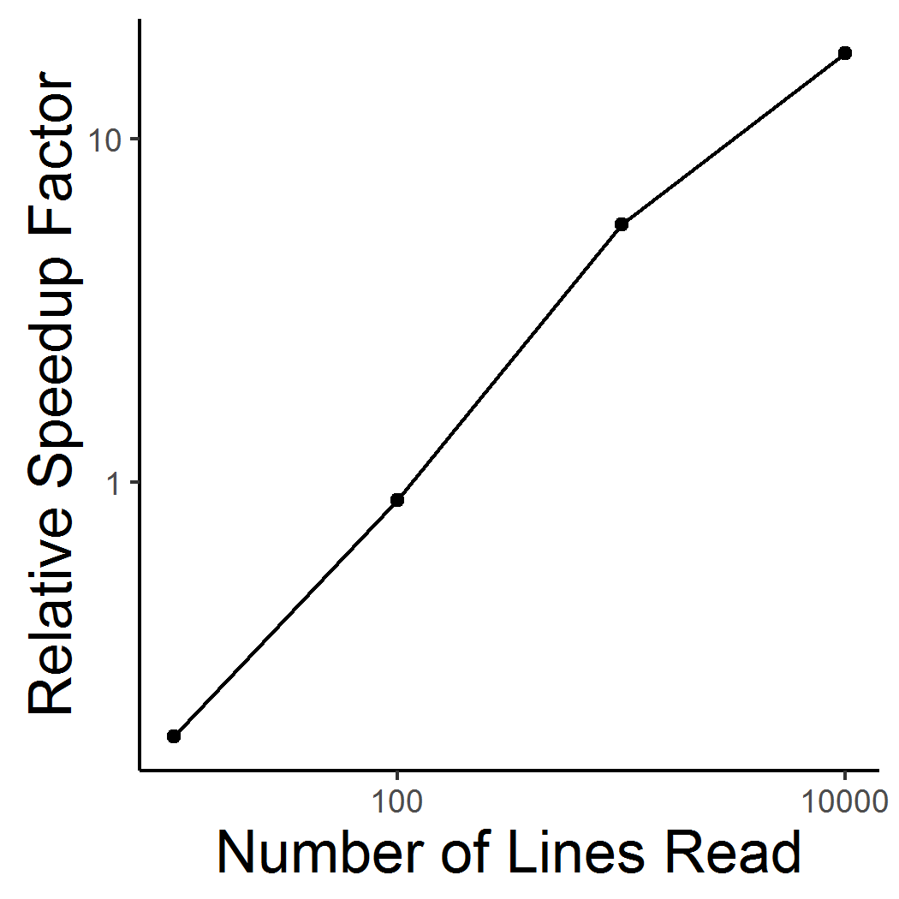

```{r setup, include=FALSE}
knitr::opts_chunk$set(echo = TRUE, warning=FALSE, message=FALSE)
```

"**[Let me be clear](https://www.youtube.com/watch?v=5oNcHS0c5W8)**", I'm going to show you how to build massive [*n*-gram](https://en.wikipedia.org/wiki/N-gram) frequency dictionaries efficently, query them efficiently, and save them to binary files efficiently using the **R** package **cmscu**. 

**C.M.S.C.U.** stands for [*Count-min sketch*](https://en.wikipedia.org/wiki/Count%E2%80%93min_sketch)
 with *conservative updating*. My interest is in applying this technique to language data. There are lots of interesting underlying details (I'll show you some below), but let’s just see it in action. Sound cool?

We developed this package as a replacement to the *DocumentTermMatrix* (**dtm**) function in **R**'s [tm](ftp://cran.r-project.org/pub/R/web/packages/tm/vignettes/tm.pdf) package for $n$-grams. [$n$-grams](https://en.wikipedia.org/wiki/N-gram) are a simple and elegant way to model the frequency of language data by *counting* the instances of words' occurences within a corpus. Even simple models like this can be computationally expensive when trying to model larger  $n$-grams (e.g., $3$- and $4$-grams) and corpora - such as [Amazon reviews](http://jmcauley.ucsd.edu/data/amazon/), [Yelp reviews](https://www.yelp.com/dataset_challenge), [Twitter posts](https://dev.twitter.com/streaming/firehose) and [H. R. Clinton's emails](https://wikileaks.org/clinton-emails/).  We don't need all the funcionality that comes with the **dtm** when we only want $n$-grams. In fact, using the **dtm** with huge datasets over larger $n$-grams is impossible. Sorry. It can't be done. We solves some computational bottlenecks  when we use **cmscu** (*detailed below*). 

If you want to learn more about how this work can be used to implement sophisticated smoothing alogrithms [check out our manuscript](http://link.springer.com/article/10.3758/s13428-016-0766-5?wt_mc=Internal.Event.1.SEM.ArticleAuthorOnlineFirst): 

    Vinson, D. W., Davis, J. K., Sindi, S. S., & Dale, R. (2016). Efficient n-gram analysis in R with cmscu. Behavior Research Methods. 48(3), 909-922. doi: 10.3758/s13428-016-0766-5

####Install dependencies
There are a few dependencies required to install **cmscu** depending on your operating system. **cmscu** was built under **R 3.1**, so first you'll need to install the latest version of **R**, [here](https://cran.r-project.org/). **cmscu**'s implementation was written in **C++**. To link this code to **R** requires a **C++** development environment. This is super easy but different for different operating systems.

  + For **Windows users** you will need to install [Rtools](https://cran.r-project.org/bin/windows/Rtools/). Since you've now downloaded the latest version of **R**, simply download and install the most recent Rtools executable.  
  + For **Mac users** you should check whether you have **xcode** (a C++ development environment). To do this, go to your command line and type this in: *xcode-select --install*. If you don't have it, it will install it for you. Then open **R**
  
After you're downloaded and installed the above, restart **R**.  **cmscu** was recently submitted to CRAN, but for now you can download it [here](https://github.com/DaveVinson/cmscu-tutorial/raw/master/cmscu.tar.gz). Once downloaded, install it by following the instruction below!

####Install & Load cmscu
```{r install, results="hide"}
#first, install Rcpp. This connects C++ code to your R environment 
install.packages('Rcpp',repos = "http://cran.stat.ucla.edu/")
#set your working directory 
setwd('~/Desktop')
#make sure you're in the right folder
getwd()
#install cmscu
install.packages('cmscu.tar.gz', repos = NULL, type = "src")
require(cmscu)
```

####Build Frequency Dictionaries
```{r tables}
# unigrams
yelp_1g <- new(FrequencyDictionary,4,2^26)
# bigrams
yelp_2g <- new(FrequencyDictionary,4,2^26)
# trigrams
yelp_3g <- new(FrequencyDictionary,4,2^26)
# 4-grams
yelp_4g <- new(FrequencyDictionary,4,2^26)
```
**CMSCU** solves three computationally taxing problems: 

1. **It saves words as integers, not strings** *new(FrequencyDictionary, ..., ...)* 
   
    + (Memory storage per word goes from [1 byte per character word](https://www.google.com/search?q=bytes+to+bit&oq=bytes+to+bit&aqs=chrome..69i57j69i64j0l4.2574j0j4&sourceid=chrome&ie=UTF-8)). We reduce this to 4 bytes per $n$-gram entry. 
    
2. **It limits dictionary size to fit within the constraints of your machine's memory** *new(..., ..., 2^26)* 
    + You won't accidently find yourself swapping hardisk space for memory (As a result your code will never finish running)
    
3. **It solves the pigeonhole problem** *new(..., 4, ...)*
   
    + The [Pigeonhole problem](https://en.wikipedia.org/wiki/Pigeonhole_principle) occurs when you **store** more entries than the size of your dictionary. When you do this, collisions occur. If "pizza" is saved to the same integer key as "funky", when you query either "funky" or "pizza" the number of counts associated with either will equal *both words combined*. However, this problem is solved by a simple princple: If a collision on one dictionary is rare, then the SAME collision (funky/pizza) occuring in an entirely indpendent dictionrary is **extremely** rare. So we build out **4** dictionaries (or hash tables) for EACH *n* dictionary.

####How to Determine Dictionary Size
This gets messy and it's hard provide a true estimate without filling our dictionaries first. Here's what we can know: 

+ **You can find out how much memory you're using upfront.** For my $8$ *gigabyte* memory machine, I'm already utilizing closer to $4$ *gigabytes* for various other applications. So I only have $~4$ *gigabytes* to allocate toward running this program. 
  
+ Each entry using **cmscu** takes $4$ *bytes* to store (no matter the word length or count).

We can do some simple math to determine the size each dictionary ($width$) should be. $1gb = 2^{30} bytes$. With $4$ bytes per entry that means we have $2^{28}$ bytes to play with. Now, we're building out $4$ ($hash$) dictionaries per each $n$-gram (*this increases our confidence in our uncertainty...more on this later*).  This means we really only have $2^{26}$ *bytes* to allocate to each size $n$. So with $1$ *gigabyte* of memory for each $n$-gram dictionary, our dictionary size ($width$) should not exceed $2^{26}$ slots *(e.g., new(FrequencyDictionary, 4, 2^26))*: 

$$\frac{{hash} * {width}}{2^{28}} = \frac{{4} * {2^{26}}}{2^{28}}= 1Gigabyte$$

####Why You Should Care 
**This gives you an estimate of the size of the dictionary you can build efficiently on your machine.**  The uncertainty in estimated counts that occur due to collisions provided a large enough corpus is essentially what you will need to be comfortable with given your machine. The more memory you have, the bigger your dictionary can be and the more certain you can be in the accuracy of your estimated counts.

+ **Note 1:** You can play around with this. Since you know that $4$-gram dictionaries are going to be bigger than $1$-gram dictionaries, you can allocate more memory toward that dictionary than others (e.g., $2^{24}$, $2^{27}$, etc). You can also bind all $n$-grams to one giant dictionary if you'd like (e.g., $2^{29}$).

+ **Note 2:** Unless you know the size of your corpus a priori (e.g., the number of unique n-grams) it will be impossible to determine what size your dictionary should be to guarantee zero uncertainty. I state this again in the diagnostics section of this tutorial just so you can see what I mean after I've given you a little more information (put this in your back pocket for now).

##CMSCU in Action

I use [Yelp reviews](https://www.yelp.com/dataset_challenge) because I am interested in uncovering how different cognitive and social factors - such as the reviewer's exprience (positive/negative) or their social network - influence how they write reviews. *(You can download them now using the link above)*

Let's start by defining a few functions:

####Functions
```{r some functions}
# a text cleaning function
clean <- function(line) {
  # upper-case everything
  str <- toupper(line);
  # strip-out small html tags
  str <- gsub('<[^>]{1,2}>', '', str);
  # replace all terminal punctuation with a period
  str <- gsub('[[:space:]]*[.?!:;]+[[:space:]]*', '.', str);
  # get rid of anything not A-Z, ', ., or whitespace
  str <- gsub('[^A-Z\'.[:space:]]', ' ', str);
  # crowd apostrophes
  # str <- gsub("[[:space:]]+([A-Z]*'[A-Z]*)", "\\1", str);
  # collapse whitespace
  str <- gsub('[[:space:]]+', ' ', str);
  # make sure contraction's are "tight"
  str <- gsub(" ?' ?", "'", str);
  # make sure terminal . are tight
  str <- gsub(' ?\\. ?', '.', str);
  return(str);
}
```

Oh we're also going to need this-
```{r this will make n-grams from a list}
# this function lets us create n-grams from a list
ngrams <- function(lst, n) {
	len <- length(lst);
	sapply(1:(len-n+1), function(i) do.call(paste, as.list(lst[i:(i+n-1)])))
}
```

Oh and you'll need this library too!
```{r load rjson, results="hide"}
# you'll need this to parse yelp reviews
install.packages("rjson", repos = "http://cran.stat.ucla.edu/")
require(rjson)
```

### The main loop 
Loop through reviews and populate dictionaries (a.k.a. train the model). (*I also provide comments for how to test your code without looping through the entire dataset.*)

**Note**: I'm using a smaller dataset that can be found on my [github page here](https://github.com/DaveVinson/cmscu-tutorial/). If you download it, be sure to unzip it before running the code below.

```{r load, run clean etc}
# connect to the file, but don't load the contents! 
Yelpfile <- file('yelp_academic_dataset_review.json', 'r', FALSE); 
# I'm using a smaller dataset than ^^ this. I cut the dataset down to roughly 10,000 reviews
# i <- 0 #create an index to break the loop early
repeat {
  # select the number of reviews to read at a time. 500 = ~550kb. 
  reviews <- readLines(con=Yelpfile, n=500);
  # Break loop when you reach the end of the file
  # if (i>1000){ #only loop through 1000 reviews for testing your loop
  if (length(reviews) == 0) { #comment out if you only want to test loop on first 1000 reviews
	  # disconnect the file link
		close(Yelpfile);
	  # break the loop
		break;
  }
  # read a single review 
  for (review in reviews){
    # parse the current review
    currev <- fromJSON(review)
    # clean the current review
    text <- clean(currev$text)
    # split reviews into sentences
    for (sentence in unlist(strsplit(text, '\\.'))) {
      # split to unigrams    
      unilist <- unlist(strsplit(sentence, ' ')) 
      # store unigrams
      yelp_1g$store(unilist)
      # add beginning and end of sentence tags to unigrams, and subsequent n-grams 
      # (crucial for smoothing ngrams in test phase)
      bilist <- c("<BOS>",unilist,'<EOS>')
      # store bigrams, use the "ngrams" function bind unigrams together
      yelp_2g$store(ngrams(bilist,2))
      # store trigrams    
      trilist <- c("<BOS>","<BOS>",unilist,'<EOS>')
      yelp_3g$store(ngrams(trilist,3))
      # store quadgrams
      qualist <- c("<BOS>","<BOS>","<BOS>",unilist,'<EOS>')
      yelp_4g$store(ngrams(qualist,4))
    }
  }
  # cat('\r', paste('Trained', i, 'lines from yelp.')); #this will track your progress through your dataset!
}
```
As the size of the dataset increases storage increases exponentially when using **dtm**. With this implemenation of **cmscu** our storage scales linearly. Below is a Log-log plot of the calculation time of **tm** relative to the calculation time of **cmscu**, averaged over ten runs, for increasingly large data sets. Due to the nonlinear scaling of **tm**, our implementation becomes increasingly faster relative to **tm** as the dataset increases in size. The memory requirements of **tm** prevents the comparison of larger data sets.
  
<div>
<figure max-width: 50%; display: inline-block;>
  <center> <center>
  </figure>
</div>


###Querying and Confidence and Diagnostics 
Now that we have frequency dictionaries we can query them. We can also check how much we might be over estimating our counts by (e.g., uncertainty) and the probabiility that we're not over-estimating by more than our uncertainty (e.g., confidence). We can also determine how densely populated the $hash$ dictionaries are, as well as the total number of entries we've added, and finally the number of unique entries (important measures when determining something like the [*information density* of a review given its star rating](https://mindmodeling.org/cogsci2014/papers/293/paper293.pdf)). 

```{r query}
# query the unigram dictionary
yelp_1g$query(c("SEE","PIZZA","JUXTAPOSED"))
# query the bigram dictionary
yelp_2g$query(c("<BOS> I","THE PIZZA","SHE JUXTAPOSED"))
```

```{r confcheck}
# The number of counts we might be over-estimating by
yelp_1g$uncertainty
# probability that we are not over-estimating by more than our 'uncertainty'
yelp_1g$confidence
#how full the your hash tables are. zero means there's no risk in collision
yelp_1g$density
# number of total n-grams in the corpus 
yelp_1g$entries
# number of unique n-grams in the corpus
yelp_1g$unique_entries
```

These diagnostics provide a measure of how well you've captured the fequency dictionary of your corpus while maintaining efficiency. Depending on the size of your corpus and the power of your machine, uncertainty (determined by your dictionary's $width$) and confidence in that uncertainty (number of $hashes$) will change. 

**Again** *unless you know the size of your corpus a priori (e.g., the number of unique n-grams) it will be impossible to determine the size your dictionary should be to confident that you have zero uncertainty (over estimation) in the counts you've estimated for each n-gram.*

###Save Frequency Dictionaries to .bin
Finally, we can now save the dictionaries to binary files. The size of your binary file will always equal the size of the table x hash functions you've specified above. In our case ~$1$ Gigabyte. That may seem big for some $n$-grams and not big enough for others, but as we now know, your computer can handle the sizes that you specify. In addition, what good is a $n$-gram corpus you *can't* query due to memory overload?

*Note: Keep your cleaning functions the same so you don't accidently query your table and come up empty handed. For instance if you STORE in UPPERCASE but query in lowercase, [you're gonna have a bad time](https://www.youtube.com/watch?v=8yU0TP3B6G8).*
```{r save,  results="hide"}
# save your dictionary to in .bin
yelp_1g$save("yelp1.bin")
```

The next step is to load it back in (which takes almost no time at all)

###Load from .bin and Query!
```{r reload Tables,  results="hide"}
# make sure your dictionary is the same size! 
frombinary_1g <- new(FrequencyDictionary, 4, 2^26)
# load it in
frombinary_1g$read("yelp1.bin") 
```

```{r query new}
# query to test
frombinary_1g$query(c("SEE","PIZZA","JUXTAPOSED"))
yelp_2g$query(c("<BOS> I","THE PIZZA","SHE JUXTAPOSED"))
```
****

####Final Thoughts 
Just a quick final thought - This package was developed to allow behavioral researchers access to a canonical NLP method ($n$-grams) to quantify larger, now freely available language datasets.. It can be used to acquire a probablistic estimate of *n*-gram counts relative to your own machine's computing constraints. 

Later, I will provide another tutorial where I will show you how **cmscu** allows you to use computationally heavy smoothing techniques, such as  "Modified Kneser-Ney" for quanifying missing $n$-grams. I show how this can be used within an information-theoretic context, again, using millions of yelp reviews. (*But if you're antsy and want it now, email me. I'm happy to help out!*)

#####Other Resources
* [Vinson, et al., (2016)](http://davevinson.com/pubs/Vinson_etal_2016_brm.pdf)

* [cmscu package and Kneser-Ney smoothing example](https://github.com/jasonkdavis/r-cmscu)

* [Stanford NLP tools](http://stanfordnlp.github.io/CoreNLP/)

* Email: [Dave@davevinson.com](dave@davevinson.com)

* Website: [Davevinson.com](davevinson.com)

* **UC Merced crew:** I used this code to build frequency dictionaries from [CoCA](http://corpus.byu.edu/coca). I will post a secure link soon! 
