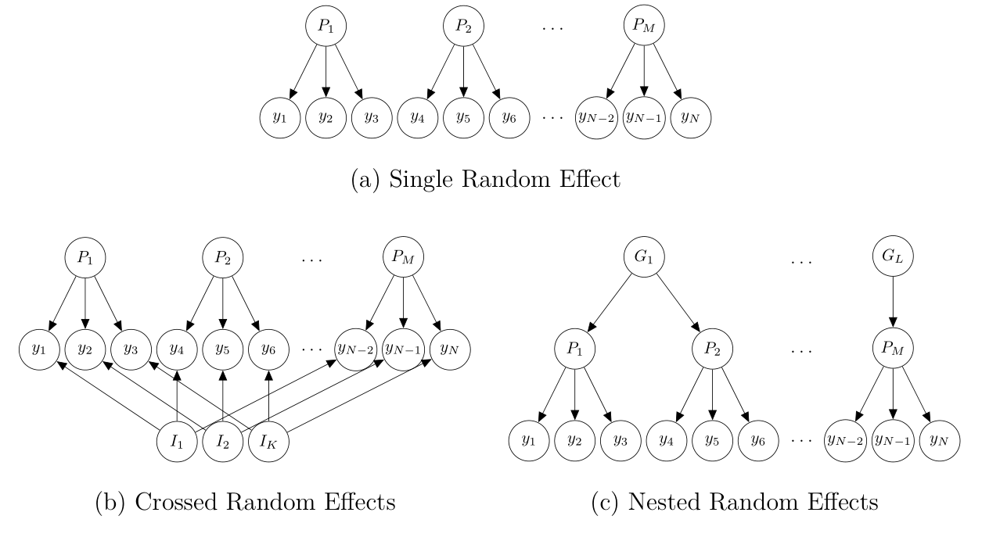

```{r setup, include=FALSE}
options(htmltools.dir.version = FALSE)
# see: https://github.com/yihui/xaringan
# install.packages("xaringan")
# see: 
# https://github.com/yihui/xaringan/wiki
# https://github.com/gnab/remark/wiki/Markdown
options(width=110)
options(digits = 4)
```

# Mixed Models

- Mixed models are a modern class of statistical models that extend regular regression models by including random effects parameters to account for dependencies among related data points.

--

.pull-left[

### Fixed Effects
- Overall  or *population-level average* effect of specific model term (i.e., main effect, interaction, parameter) on dependent variable
- Independent of stochastic variability controlled for by random effects
- Hyptothesis tests on fixed effect interpreted as hypothesis tests for terms in standard ANOVA or regression model
- Possible to test specific hypotheses among factor levels (e.g., planned contrasts)

]

.pull-right[
### Random Effects

- *Random-effects grouping factors*: Categorical variables that capture random or stochastic variability (e.g., participants, items, groups, or other hierarchical-structures).
- In experimental settings, random effects grouping factors often part of design one wants to generalize over.
- Random effects factor out idiosyncrasies of sample, thereby providing a more general estimate of the fixed effects of interest.
- *Random-effects parameters*: Provide each level of random effect grouping factor with idiosyncratic parameter set.

]

---
class:small

```{r, echo=FALSE, results='hide', message=FALSE}
load("../exercises/ssk16_dat_preapred.rda")
str(dat)
datr <- droplevels(dat[dat$rel_cond != "NE" & dat$dv_question == "probability",])
require(ggplot2)
afex::set_sum_contrasts()
require(lme4)
```


# Example Data

Reduced data of Skovgaard-Olsen et al. (2016):
- 2 relevance conditions: positive and negative
- No between-subjects condition (only probability question)

.pull-left[

```{r}
m_fixed <- lm(dv ~ c_given_a*rel_cond, datr)
summary(m_fixed)
```
]
.pull-right[

```{r, echo=FALSE, dpi=500, fig.width=7, fig.height=4}
par(mfrow = c(1,2))
par(pty="s")
limits <- c(-0.5, 0.5)
plot(dv ~ c_given_a, datr, subset = rel_cond == "PO", 
     asp = 1, ylim=limits, xlim=limits, main ="PO")
abline(a = coef(m_fixed)[1] + coef(m_fixed)[3], 
       b = coef(m_fixed)[2] + coef(m_fixed)[4])
plot(dv ~ c_given_a, datr, subset = rel_cond == "IR", 
     asp = 1, ylim=limits, xlim=limits, main ="IR")
abline(a = coef(m_fixed)[1] - coef(m_fixed)[3], 
       b = coef(m_fixed)[2] - coef(m_fixed)[4])
```

$$y=\beta_0 + \beta_{C|A}X_{C|A} + \beta_{r}X_{r} + \beta_{I}X_{I} + \epsilon$$

]

---
class: small

.pull-left[
### Fixed Effects Model

$$y=\beta_0 + \beta_{C|A}X_{C|A} + \beta_{r}X_{r} + \beta_{I}X_{I} + \epsilon$$

- $\beta$ are scalar regression parameters
- $X$ are covariate vectors (numerical independent variables with -1 and 1 for factors)
- assumes error vector $\epsilon$ is *iid*, $\epsilon \sim \mathcal{N}(0, \sigma^2_{\epsilon})$, which is likely false.
]

.pull-right[
```{r, echo=FALSE, dpi=500, fig.width=7, fig.height=4}
par(mfrow = c(1,2))
par(pty="s")
limits <- c(-0.5, 0.5)
plot(dv ~ c_given_a, datr, subset = rel_cond == "PO", 
     asp = 1, ylim=limits, xlim=limits, main ="PO")
abline(a = coef(m_fixed)[1] + coef(m_fixed)[3], 
       b = coef(m_fixed)[2] + coef(m_fixed)[4])
plot(dv ~ c_given_a, datr, subset = rel_cond == "IR", 
     asp = 1, ylim=limits, xlim=limits, main ="IR")
abline(a = coef(m_fixed)[1] - coef(m_fixed)[3], 
       b = coef(m_fixed)[2] - coef(m_fixed)[4])
```
]

--

### A First Mixed Effects Model

$$y=\beta_0 + (\beta_{C|A}+ S_{C|A})X_{C|A} + \beta_{r}X_{r} + \beta_{I}X_{I} + \epsilon$$
- $S_{C|A}$ is a zero-centered vector of participant specific random effects: $S_{C|A} \sim \mathcal{N}(0, \sigma^2_{S_{C|A}})$
- $S_{C|A}$ provides each participant with their own regression weight: overall $\beta_{C|A}$ plus idiosyncratic $S_{C|A}$.
- As parameter, model estimates variance of random effects vector, $\sigma^2_{S_{C|A}}$.
- As $S_{C|A}$ alters the regression slope $\beta_{C|A}$, also known as *random slope*.
- In `lme4::lmer` syntax: `lmer(dv ~ c_given_a*rel_cond + (0+c_given_a|p_id), datr)`

---
class: small

### A More Reasonable Mixed Model

First model did not allow for different $\beta$s for each participant and relevance condition. 

$$y=\beta_0 + (\beta_{C|A}+ S_{C|A})X_{C|A} + \beta_{r}X_{r} + (\beta_{I}+ S_{I})X_{I} + \epsilon$$
- Model now has two random slopes, $S_{C|A}$ and $S_{I}$.
- $S$ are still zero-centered vector of participant specific random effects. However, we now estimate both, variance and covariance of random effects:
  
$$\left( \begin{matrix} S_{C|A} \\ S_{I} \end{matrix} \right)
 \sim \mathcal{N}\left( \left[ \begin{matrix} 0 \\ 0 \end{matrix} \right] , \left[ \begin{matrix} \sigma^2_{S_{C|A}}&\rho_{S_{C|A},S_{I}}\sigma_{S_{C|A}}\sigma_{S_{I}} \\ \rho_{S_{I},S_{C|A}}\sigma_{S_{C|A}}\sigma_{S_{I}}&\sigma^2_{S_{I}} \end{matrix} \right] \right)$$

- This model allows each participant to have idosyncratic slope per relevance condition.

--

### Interim Summary

*Fixed-effects parameters*: Overall  effect of specific model term on dependent variable

*Random-effects parameters*: 
- zero-centered offsets/displacements for each level of random effect grouping factor
- added to specific fixed effect parameter
- assumed to follow normal distribution which provides hierarchical shrinkage, thereby avoids overfitting
- should be added to each parameter that varies within the levels of a random effects grouping factor

---
class: small
### Maximal By-Participant Mixed Model

$$y=\beta_0 + S_0 + (\beta_{C|A}+ S_{C|A})X_{C|A} + (\beta_{r}+ S_{r})X_{r} + (\beta_{I}+ S_{I})X_{I} + \epsilon$$
- Model estimates 4 variances for zero-centered $S$ vectors and 6 correlations among random effects.

--

```{r}
require(lme4)
m_p_max <- lmer(dv ~ c_given_a*rel_cond + (c_given_a*rel_cond|p_id), datr)
summary(m_p_max)$varcor
summary(m_p_max)$coefficients

```

---
class: small
## Crossed Random-Effects

So far only considered *participant* as random effects grouping factor:
- Each participant provides several responses: Random-intercept allows idiosyncratic intercept.
- `c_given_a` and `rel_cond` are within-subjects variables: Random-slopes allow idiosyncratic effects.

Participant is only one source of stochastic variability. We usually want to genealize over both *participants* and *items*. 
- Example data: Each participant provides 1 response for each of 12 items with condition randomly selected.
- All factors also vary within-items.

Mixed models allow multiple independent random effects (where $I$ are vectors of item-specific offsets):

$$y=\beta_0 + S_0 + I_0 + (\beta_{C|A} + S_{C|A} + I_{C|A})X_{C|A} + (\beta_{r} + S_{r}+ I_{r})X_{r} + (\beta_{I}+ S_{I}+ I_{I})X_{I} + \epsilon$$

```{r}
m_max <- lmer(dv ~ c_given_a*rel_cond + 
                (c_given_a*rel_cond|p_id) + 
                (c_given_a*rel_cond|i_id), 
              datr)
```


---
class: small

```{r}
summary(m_max)
```

---
class: small
### Types of Random Effects



---
class: small

# Hypothesis-Tests for Mixed Models

`lme4::lmer` does not include *p*-values.

`afex::mixed` provides four different methods:
1. Kenward-Roger (`method="KR"`, default): Provides best-protection against anti-conservative results, requires a lot of RAM for complicated random-effects structures.
2. Satterthwaite (`method="S"`): Similar to KR, but requires less RAM.
3. Parametric-bootstrap (`method="PB"`): Simulation-based, can take a lot of time (can be speed-up using parallel computation).
4. Likelihood-ratio tests (`method="LRT"`): Provides worst control for anti-conservative results. Can be used if all else fails or if all random effects grouping factors have large numbers of levels (e.g., over 50).

Methods do not differ for example data:

```{r, eval=FALSE}
require(afex)
mixed(dv ~ c_given_a*rel_cond + (c_given_a*rel_cond|p_id), datr, method = "KR") 
mixed(dv ~ c_given_a*rel_cond + (c_given_a*rel_cond|p_id), datr, method = "S") 
mixed(dv ~ c_given_a*rel_cond + (c_given_a*rel_cond|p_id), datr, method = "LRT") 
# mixed(dv ~ c_given_a*rel_cond + (c_given_a*rel_cond|p_id), datr, method = "PB") 
```

---
class:small

# Specifying Random-Effects Structure

- Omitting random-effects parameters for model terms which vary within the levels of a random-effects grouping factor and for which random variability exists leads to non-iid residuals (i.e., $\epsilon$) and anti-conservative results (e.g., Barr, Levy, Scheepers, & Tily, 2013).
- Safeguard is *maximal model justified by the design*.
- If maximal model is overparameterized and/or contains degenrate estimates or singular fits, power of maximal model can be severly reduced and a reduced model should be used (Bates et al., 2015; Matuschek et al., 2017).

Steps for running a mixed model analysis:
1. Identify desired fixed-effects structure
2. Identify random-effects grouping factors
3. Identify which factors/terms vary within levels of each random-effects grouping factor: maximal model
5. Choose method for calculating *p*-values and fit maximal model

If the maximal model shows critical convergence warnings, reduce random-effects structure:
- Start by removing the correlation among random-effects parameters
- Remove random-effects parameters for highest-order effects with lowest variance
- It can sometimes help to try different optimizers
- Compare *p*-values and fixed-effects estimates across models

---
class: center, middle, inverse

# Exercise 2

--- 


---
class: small
### References Mixed Modeling:
- Singmann, H., & Kellen, D. (in press). An Introduction to Mixed Models for Experimental Psychology. In D. H. Spieler & E. Schumacher (Eds.), *New Methods in Neuroscience and Cognitive Psychology*. Psychology Press. http://singmann.org/download/publications/singmann_kellen-introduction-mixed-models.pdf
- Barr, D. J., Levy, R., Scheepers, C., & Tily, H. J. (2013). Random effects structure for confirmatory hypothesis testing: Keep it maximal. *Journal of Memory and Language*, 68(3), 255-278. https://doi.org/10.1016/j.jml.2012.11.001
- Bates, D., Kliegl, R., Vasishth, S., & Baayen, H. (2015). *Parsimonious Mixed Models.* arXiv:1506.04967 [stat]. http://arxiv.org/abs/1506.04967
- Matuschek, H., Kliegl, R., Vasishth, S., Baayen, H., & Bates, D. (2017). Balancing Type I error and power in linear mixed models. *Journal of Memory and Language*, 94, 305-315. https://doi.org/10.1016/j.jml.2017.01.001


### References Example Data:
- Skovgaard-Olsen, N., Singmann, H., & Klauer, K. C. (2016). The relevance effect and conditionals. *Cognition*, 150, 26-36. https://doi.org/10.1016/j.cognition.2015.12.017


```{r, eval=FALSE, include=FALSE}
require(afex)
load("../exercises/ssk16_dat_preapred.rda")
```

```{r, eval=FALSE, include=FALSE}

m_full <- mixed(dv ~ c_given_a*rel_cond*dv_question +
                       (rel_cond*c_given_a|lfdn) +
                       (rel_cond*c_given_a*dv_question|le_nr),
                     dat,
                     control = lmerControl(optCtrl = list(maxfun=1e8)),
                     method = "S")

save(m_full, file = "fitted_lmms.rda", compress = "xz")
```
